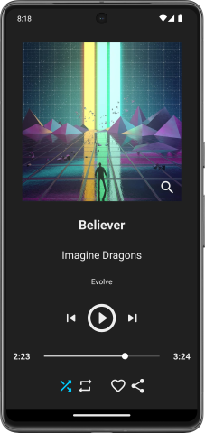

# Music
Music is an audio player app. It offers the basics of any music player: change songs, shuffle, repeat...

It was built in **Kotlin** using **Android Studio**.

> [!NOTE]  
This app was developed during my time as a student, under a tight deadline and while managing other projects.
It offers the core functionality, but you may encounter bugs, rough edges, and code that’s not production-ready. 

# Screenshots

  
  

